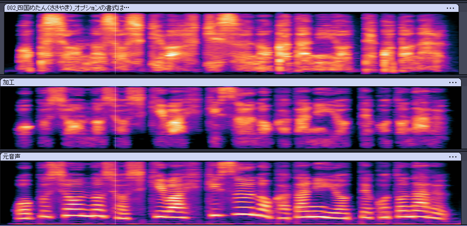

# whisper

音声をささやき声にしたい

## 手法
今のところ: 
- ボコーダで分離してホワイトノイズで駆動させる
- スペクトル包絡に対してPhantom Silhouette方式に基づいた加工を行う
  - 低周波数帯のシフト
  - 高周波数帯の補償
  - 低周波数のカット

## issues
### f0が高い/低い音声だと不自然になる？
- 鳴花ミコトNV(A.I.VOICE 2)で生成した音声（f0中央値: 180Hzくらい）では悪くない（と思う）
- 四国めたん(VOICEVOX) の音声（f0中央値: 245Hzくらい）では異常に質が悪い

必要な切り分け(TODO): 
- 加工元が合成音声であるから？
  - 各ソフトの他音声を使って試してみる
    - VOICEVOXの他モデル、アイボス2の他モデル、別の合成エンジン
  - 人間の声でも試す

関連:
- 四国めたん(ささやき) のスペクトログラムを見ると、500Hz以下の部分も結構ある
  - ので、ただカットする他になにかできる事があるかもしれない
  - とりあえずスペクトル包絡とにらめっこしてみるといいかも
- スペクトログラム見てると全体的に加工後の音声は細い
  - 太いサウンドの方がいいんじゃないか
  - もしかして完全に無声音にしない方が良かったりする？

